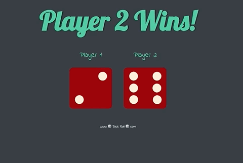
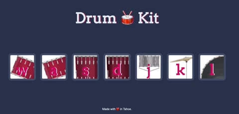
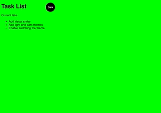
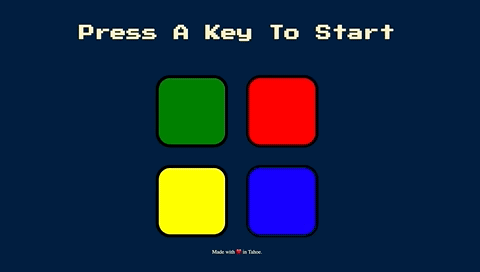

# Practice:

> A series of small projects built for coding practice and expanding knowledge

#### Table of Contents

* [APPLICATIONS](#)
     * [DOM_Dice](#DOM_Dice)
     * [Drum_Kit](#Drum_Kit)
     * [Simple_Website](#Simple_Website)
     * [Simon_Game](#Simon_Game)
     * [Calculator](#Calculator)

### DOM_Dice

>A simple dice rolling game that uses HTML, CSS and JavaScript to manipulate the DOM and update player1 and player2 dice on refresh.

|   Stack    | 
|------------|
|   HTML     |  
|   CSS      |  
| JavaScript |  

### Drum_Kit

> An interactive drum kit that uses HTML, CSS and Javascript. The drum kit takes advantage of event listeners in Javascript so that a user can either "click" on the desired precussion or "press the key " that matches the desired note.

|   Stack    | 
|------------|
|   HTML     |  
|   CSS      |  
| JavaScript |  

# Simple_Website

>This simple website was created using HTML, CSS and Javacsript. The main function was really to practice switching between a light and dark mode of a website utilizing event listeners and toggling between the light v. dark css.

|   Stack    | 
|------------|
|   HTML     |  
|   CSS      |  
| JavaScript |  

# Simon_Game

>The Simon Game is a virtual version of the popular game Simon created using HTML, CSS and Javascript. 

|   Stack    | 
|------------|
|   HTML     |  
|   CSS      |  
| JavaScript |  

# Calculator

>Simple calculator application built using HTML, CSS, Javascript, Node.js and Express.

